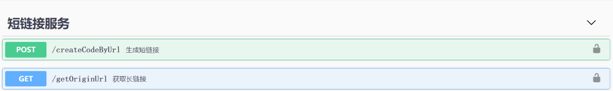

# 短链接服务

**短链接介绍**

```
大家应该收到过类似的推广短信
----------------------
【拼XX】已核对：8923亲，
恭喜您被选中有机会免费收件唐山市华为P40(蓝色)！
不领将作废 xxx.com/r/43CIge6 回TD退
----------------------
点击“xxx.com/r/43CIge6”会跳转到链接为“https://mobile.yantgkeduo.com/mhf_binvite.html?activity_scene=61&src=jurassic&campaign=jurassic_sms&cid=jurassic_sms_p6658_0824_0&sid=jurassic_sms_default&cipher_code=%E2%87%A5Nh92uWPK8olzj%E2%87%A4&end_num=33&_p_landing=1&refer_page_name=mhf_binter&refer_page_id=68033_1598267264425_1lfudll2j1&refer_page_sn=68033&_x_msgid=8401765402524-msg-1510-o6658015982345974599#back”的页面
“xxx.com/r/43CIge6”即为长链接“https://mobile.yangkyeduo.com/mhf_binvite.html?activity_scene=61&src=jurassic&campaign=jurass33ic_sms&cid=jurassic_sms_p6658_0824_0&sid=jurassic_sms_default&cipher_code=%E2%87%A5Nh92uWPK8olzj%E2%87%A4&end_num=8923&_p_landing=1&refer_page_name=mhf_binter&refer_page_id=68033_1598267264425_1lfudll2j1&refer_page_sn=68033&_x_msgid=8401765402524-msg-1510-o6658015982345974599#back”的短链接
```

#### 短链接优势
    短链接简短，有效规避字数限制
    安全，不会暴露访问参数
    统计，便于后续统计分析

#### 短链接实现原理
1. 将原始链接（长链接）编码之后对应成一个或多个短链接，服务端记录映射关系.
    > 例如 https://github.com/scdt-china/interview-assignments/tree/master/java  -> IP:8080/r/43CIew1  
    服务端记录 43CIew1 -> https://github.com/scdt-china/interview-assignments/tree/master/java映射关系   
  
2. 客户端（app/web）访问短链接，短链接服务，根据编码映射出原始链接，重定向（[301/302](https://developer.mozilla.org/zh-CN/docs/Web/HTTP/Redirections)）跳转原始的长链接
    > 例如 客户端访问 IP:8080/r/43CIew1  ，本质是是访问部署在localhost机器占用端口8080，接口路由为/r的接口,路由参数为43CIew1  （编码）  
    根据编码（43CIew1  ）检索出对应的原始链接并重定向跳转  

- 短地址的长度？  
  
    > 编码之后的短链接本质上属于以拼接参数的restapi接口的uri    
    - 域名，运维配合分配较短的域名。  
    - 接口路由， 根/或者/r/等尽量简短明了。  
    - 编码，尽量短，业务需求：数字、大小写字母，0-9、A-Z、a-z共62个字符，62进制编码即可。    
- 短地址编码算法？
    - 最简单的对长链接通过哈希，得到哈希值，转换成62进制即可，取全部或部分；但是哈希算法会有冲突，解决冲突比较麻烦。
    - 分布式发号器(Distributed ID Generator)，可通过MySQL自增id/雪花算法/Redis incr获取自增值（解决上述哈希冲突问题），并转换为62进制编码，本例用当前时间做为发号器，实际生产中用Redis incr获取自增值或雪花算法。  
  结论： **分布式发号器**
- 服务端如何存储短链接与长链接的对应？
    - 方式一，关系型数据库，MySQL自增id主键，编码；
    - 方式二，key-value存储，redis
    - 方式三,   本例用的是LIST集合全局静态变量（仅仅用于演示）

#### 实现方案
- 软件架构 Springboot 
- LIST集合全局静态变量存储短链接与长链接的对应关系（仅仅用于演示），生产环境使用关系型数据库或Redis保存关系
- 当前时间作为发号器，解决哈希算法冲突问题，生产环境用MySQL自增id/雪花算法/Redis incr获取自增值作为发号器

#### 实体结构

``` java
   /**
     * id
     */
    private Long id;
    /**
     * 短链接编码62进制
     */
    private String smartCode;
    /**
     * 原始链接
     */
    private String originUrl;
    
```

#### 接口

```
1、短域名存储接口：接受长域名信息，返回短域名信息
2、短域名读取接口：接受短域名信息，返回长域名信息
```

##### Contorller接口
- 长链接编码成短链接  

```json
入参：https://github.com/scdt-china/interview-assignments/tree/master/java  POST请求
    
返回值
{
  "status": 200,
  "code": 200,
  "message": "操作成功",
  "data": "localhost:8080/r/43CIge6",
  "time": 1675134422674,
  "success": true
}
返回值data中的43CIge6是短链接编码
```
- 短链接解码长链接301重定向跳转（为了避免路由过长，使用“/r”,未使用“/”避免转发失败）

```json
入参：43CIge6

返回值
{
  "status": 200,
  "code": 200,
  "message": "操作成功",
  "data": "https://github.com/scdt-china/interview-assignments/tree/master/java",
  "time": 1675134561702,
  "success": true
}
```

#### 扩展&优化
- url的有效性验证
- 短链接时效
- 浏览次数，便于后续业务分析（字段已预留，功能已实现）
- 应用配置
    - 映射失败，重定固定地址，（已实现，百度首页，可自定义）
    
    - 短域名申请、配置在文件里（待优化）
    
      

**Swagger地址**： http://localhost:8080/swagger-ui




**Jacoco测试**

方案：采用Springboot + maven集成的方式实现

pom.xml要修改的

```
<dependency>
			<groupId>org.jacoco</groupId>
			<artifactId>jacoco-maven-plugin</artifactId>
			<version>${jacoco.version}</version>
</dependency>
		
		
		
<build>
		<plugins>
			<plugin>
				<groupId>org.springframework.boot</groupId>
				<artifactId>spring-boot-maven-plugin</artifactId>
			</plugin>
			<plugin>
				<groupId>org.jacoco</groupId>
				<artifactId>jacoco-maven-plugin</artifactId>
				<version>${jacoco.version}</version>
				<executions>
					<execution>
						<id>default-prepare-agent</id>
						<goals>
							<goal>prepare-agent</goal>
						</goals>
					</execution>
					<execution>
						<id>default-report</id>
						<goals>
							<goal>report</goal>
						</goals>
					</execution>
				</executions>
			</plugin>

		</plugins>
	</build>		
```

生成Jacoco测试报告

```
maven install
```


查看报告，打开index.html


图片在README目录下

